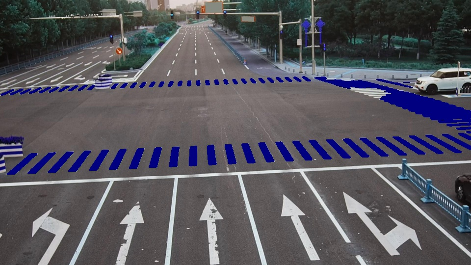

## 斑马线分割DEMO  

---
### WHAT TO DO?
使用U-Net对斑马线进行分割。

### HOW TO DO?
- 标注： 使用labelme标注，可通过pip安装，exe安装需付费
- 训练：环境为python=3.8,torch=1.12.1+cu116，执行代码train.py
- 测试：执行代码test.py

### RESULT  
32张标注图片，训练了50个epoch，效果如下：  

  

